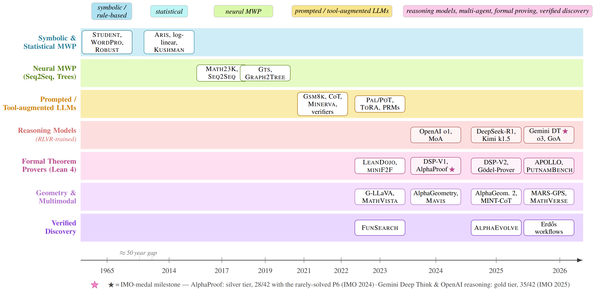
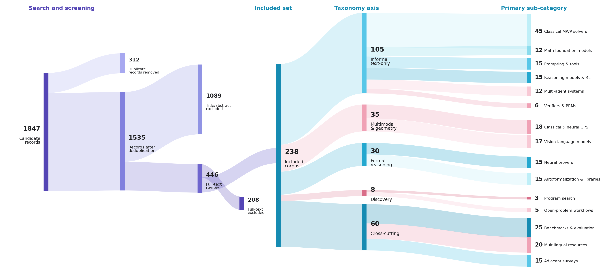
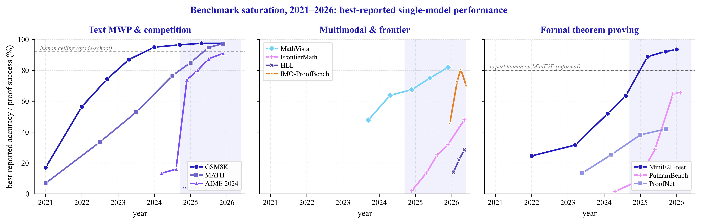

<div align="center">

# 🧮 AI for Mathematical Reasoning
### An Integrated Survey of Language Models, Neuro-symbolic Systems, and Verified Discovery

<p>
<a href="https://github.com/sindresorhus/awesome#readme"></a>

<a href="#citation"></a>
<a href="#license"></a>


</p>

<p><em>A companion resource hub for the survey paper. This page indexes every system, dataset, benchmark, and methodology the survey discusses, organised by the same four-axis taxonomy: <strong>informal text-only · multimodal · formal · discovery</strong>.</em></p>

</div>

---

## TL;DR

What began in the mid-1960s as brittle pattern-matching programs for templated arithmetic has — within the past four years — expanded into a landscape of AI systems that solve Olympiad-level problems, formally verify mathematical arguments in Lean 4, and contribute to the resolution of open problems posed by Paul Erdős. This survey provides an integrated account of that arc, connecting the classical MWP lineage, multimodal geometry, formal theorem proving, and verified mathematical discovery through the **reasoning-model era** of 2024–2026.

**Three things distinguish this survey:**
1. **Four-axis taxonomy** — informal text, multimodal, formal, discovery — covered as co-equal axes rather than as a single LLM-centric thread.
2. **Supervision-ladder framework** — a unified reading of the field's progression from hand-coded schemata through formal proof-assistant kernels as a sequence of increasingly informative external verifiers.
3. **Comprehension–Generation–Verification (CGV) triad** — a refinement of recent two-stage LLM-centric framings, promoting verification from an optional post-hoc filter to a co-equal training-time component.

---

## Contents

- [TL;DR](#tldr)
- [Visual Overview](#visual-overview)
- [Benchmark Saturation, 2021–2026](#benchmark-saturation-20212026)
- [The Four Axes](#the-four-axes)
- [Section I — Math Word Problem Solving](#section-i--math-word-problem-solving)
- [Section II — The LLM and Reasoning-Model Era](#section-ii--the-llm-and-reasoning-model-era)
- [Section III — Multimodal & Geometry](#section-iii--multimodal--geometry)
- [Section IV — Formal Theorem Proving](#section-iv--formal-theorem-proving)
- [Section V — Mathematical Discovery & Open Problems](#section-v--mathematical-discovery--open-problems)
- [Section VI — Datasets & Benchmarks](#section-vi--datasets--benchmarks)
- [Section VII — Failure Modes & Open Questions](#section-vii--failure-modes--open-questions)
- [Section VIII — Mathematicians' Perspectives](#section-viii--mathematicians-perspectives)
- [Related Surveys](#related-surveys)
- [Citation](#citation)
- [Contributing](#contributing)
- [License](#license)

---

## Visual Overview

**Paradigm chronology** — seven swimlanes from STUDENT (1965) to verified discovery (2026):

<div align="center">

<p><em>Figure: Chronology of AI systems for mathematical reasoning, organised as paradigm swimlanes. Early symbolic and statistical MWP solvers (1965–2016, compressed axis) yield to neural expression generators (2017–2020), prompted and tool-augmented LLMs (2021–2023), and the 2024–2026 convergence of RLVR-trained reasoning models, Lean-based proof assistants, multimodal geometers, and verified-discovery systems. Stars mark IMO-medal milestones.</em></p>
</div>

**Methodology funnel** — 1,847 candidate records → 238 included:

<div align="center">

</div>

---

## Benchmark Saturation, 2021–2026

<div align="center">

<p><em>Three patterns: (i) <strong>GSM8K and MATH have effectively saturated</strong> — both clear 95% by 2025; (ii) <strong>AIME 2024, FrontierMath, and PutnamBench show a discontinuity</strong> at the onset of the reasoning-model era; (iii) <strong>formal proving has moved fastest in relative terms</strong> — MiniF2F-test rose from ~25% (2022) to 93% (2026); PutnamBench from near-zero to over 60% in just over a year.</em></p>
</div>

| Benchmark | Pre-DL | Seq2Tree | LLM era | Reasoning era |
|---|---|---|---|---|
| **MAWPS** | ~60% | 92.0% | >95% | >99% |
| **GSM8K** | — | 55% | 94.6% *(GPT-4o)* | 97.3% *(Kimi K2)* |
| **MATH-500** | — | 6.9% *(GPT-3)* | 52% *(GPT-4)* | 99.2% *(LongCat)* |
| **AIME 2024** | — | — | 12% *(GPT-4o)* | 91.6% *(o3)* |
| **AIME 2025** | — | — | — | 94.6% *(SU-01 / GPT-5.5 H)* |
| **GPQA-D** | — | — | 53.6% *(GPT-4o)* | 94.6% *(Claude Mythos)* |
| **FrontierMath** | — | — | <2% *(GPT-4o)* | 48% *(co-math. T4)*ᶧ |
| **MiniF2F-test** | — | — | 50% *(DSP-V1)* | 99.6% *(AlphaProof + TTRL)* |
| **PutnamBench** | — | — | — | 86/658 *(Goedel-V2-32B)* |
| **IMO-ProofBench** | — | — | — | 80.7% *(GPT-5.5 H)* |

<sub>ᶧ Tier-4 (research grade); other rows are Tier 1–3 average.</sub>

---

## The Four Axes

| Axis | Defining task | Representative artefact | Verifier |
|---|---|---|---|
| **Informal text-only** | MWPs, competition QA | Numeric answer, CoT trace | Exact-match / answer parser |
| **Multimodal & geometry** | Diagram + text problems | Construction, proof sketch | Symbolic geometry solver, MLLM grader |
| **Formal proving** | Theorems in Lean / Coq / Isabelle | Tactic script, proof term | Proof-assistant kernel |
| **Mathematical discovery** | Open problems, improved bounds | Program, construction, verified theorem | Domain evaluator + Lean kernel + expert audit |

---

## Section I — Math Word Problem Solving

### Rule-based & Statistical

- **[STUDENT — Natural language input for a computer problem solving system](https://dspace.mit.edu/handle/1721.1/5922)** — Bobrow. *MIT AI Memo, 1964.*
- **[Computers and Thought](https://archive.org/details/computersthought00feig)** — Feigenbaum & Feldman (eds.). *McGraw-Hill, 1963.*
- **[Understanding and solving arithmetic word problems: A computer simulation (WordPro)](https://link.springer.com/article/10.3758/BF03207654)** — Fletcher. *Behaviour Research Methods, 1985.*
- **[Robust understanding of word problems with extraneous information](https://arxiv.org/pdf/math/0701393)** — Bakman. *arXiv:math/0701393, 2007.*
- **[Frame-based calculus of solving arithmetic multi-step addition and subtraction word problems](https://ieeexplore.ieee.org/document/5458590/)** — Yuhui et al. *ETCS, 2010.*
- **[A review of methods for automatic understanding of natural-language mathematical problems](https://link.springer.com/article/10.1007/s10462-009-9110-0)** — Mukherjee & Garain. *Artificial Intelligence Review, 2008.*
- **[Learning to automatically solve algebra word problems](https://aclanthology.org/P14-1026.pdf)** — Kushman et al. *ACL, 2014.*
- **[Reasoning about quantities in natural language](https://aclanthology.org/Q15-1001.pdf)** — Roy, Vieira, Roth. *TACL, 2015.*
- **[ARIS — Learning to solve arithmetic problems with verb categorisation](https://aclanthology.org/D14-1058.pdf)** — Hosseini et al. *EMNLP, 2014.*
- **[Learn to solve algebra word problems using quadratic programming](https://aclanthology.org/D15-1096.pdf)** — Zhou, Dai, Chen. *EMNLP, 2015.*
- **[Learning to use formulae to solve simple arithmetic problems](https://aclanthology.org/P16-1202.pdf)** — Mitra & Baral. *ACL, 2016.*
- **[A tag-based English math word problem solver](https://aclanthology.org/N16-3014.pdf)** — Liang et al. *NAACL Demos, 2016.*
- **[Unit dependency graph and its application to arithmetic word problem solving](https://arxiv.org/pdf/1612.00969)** — Roy & Roth. *AAAI, 2017.*
- **[Solving general arithmetic word problems](https://arxiv.org/pdf/1608.01413)** — Roy & Roth. *arXiv:1608.01413, 2016.*
- **[Equation parsing: Mapping sentences to grounded equations](https://arxiv.org/pdf/1609.08824)** — Roy, Upadhyay, Roth. *arXiv:1609.08824, 2016.*

### Tree-based & Semantic Parsing

- **[Parsing algebraic word problems into equations](https://aclanthology.org/Q15-1042.pdf)** — Koncel-Kedziorski et al. *TACL, 2015.*
- **[A goal-driven tree-structured neural model for math word problems (GTS)](https://www.ijcai.org/proceedings/2019/0736.pdf)** — Xie & Sun. *IJCAI, 2019.*
- **[Tree-structured decoding for solving math word problems](https://aclanthology.org/D19-1241.pdf)** — Liu et al. *EMNLP-IJCNLP, 2019.*
- **[Graph2Tree — Graph-to-tree learning for solving math word problems](https://aclanthology.org/2020.acl-main.362.pdf)** — Zhang et al. *ACL, 2020.*
- **[A knowledge-aware sequence-to-tree network](https://aclanthology.org/2020.emnlp-main.579.pdf)** — Wu et al. *EMNLP, 2020.*
- **[Teacher–student networks with multiple decoders](https://www.ijcai.org/proceedings/2020/0555.pdf)** — Zhang et al. *IJCAI, 2020.*
- **[Improving MWPs with pre-trained knowledge and hierarchical reasoning](https://aclanthology.org/2021.emnlp-main.272.pdf)** — Yu et al. *EMNLP, 2021.*
- **[HMS — A hierarchical solver with dependency-enhanced understanding](https://ojs.aaai.org/index.php/AAAI/article/view/16547)** — Lin et al. *AAAI, 2021.*
- **[Neural-symbolic solver for MWPs with auxiliary tasks](https://arxiv.org/pdf/2107.01431)** — Qin et al. *arXiv:2107.01431, 2021.*
- **[MWP-BERT — A strong baseline for MWPs](https://arxiv.org/pdf/2107.13435)** — Liang et al. *arXiv:2107.13435, 2021.*
- **[Learning to Reason Deductively: Math Word Problem Solving as Complex Relation Extraction](https://aclanthology.org/2022.acl-long.410.pdf)** — Jie, Li, Lu. *ACL, 2022.*

### Neural MWP (Seq2Seq, GTS, Graph2Tree)

- **[Deep neural solver for math word problems](https://aclanthology.org/D17-1088.pdf)** — Wang, Liu, Shi. *EMNLP, 2017.* — first large-scale Seq2Seq on Math23K.
- **[Translating a math word problem to an expression tree](https://arxiv.org/pdf/1811.05632)** — Wang et al. *arXiv:1811.05632, 2018.*
- **[Semantically-aligned equation generation](https://arxiv.org/pdf/1811.00720)** — Chiang & Chen. *NAACL, 2019.*
- **[Modeling intra-relation in MWPs with multi-head attention](https://aclanthology.org/P19-1619.pdf)** — Li et al. *ACL, 2019.*
- **[Template-based MWP solvers with recursive neural networks](https://ojs.aaai.org/index.php/AAAI/article/view/4697)** — Wang et al. *AAAI, 2019.*
- **[Neural MWP solver with reinforcement learning](https://aclanthology.org/C18-1018.pdf)** — Huang et al. *COLING, 2018.*
- **[Reverse-operation-based data augmentation](https://arxiv.org/pdf/2010.01556)** — Liu et al. *arXiv:2010.01556, 2020.*
- **[Point to the expression — Expression-pointer transformer](https://aclanthology.org/2020.emnlp-main.308.pdf)** — Kim et al. *EMNLP, 2020.*
- **[Solving MWPs with multi-encoders and multi-decoders](https://aclanthology.org/2020.coling-main.262.pdf)** — Shen & Jin. *COLING, 2020.*
- **[SMART — Situation model for algebra story problems via attributed grammar](https://arxiv.org/pdf/2012.14011)** — Hong et al. *AAAI, 2021.*
- **[Learning by fixing — Weakly supervised MWPs](https://arxiv.org/pdf/2012.10582)** — Hong et al. *AAAI, 2021.*
- **[Recall and Learn — Memory-augmented MWP solver](https://arxiv.org/pdf/2109.13112)** — Huang et al. *arXiv:2109.13112, 2021.*
- **[Are NLP models really able to solve simple math word problems? (SVAMP)](https://arxiv.org/pdf/2103.07191)** — Patel et al. *NAACL, 2021.*
- **[Generate & Rank — Multi-task framework for MWPs](https://arxiv.org/pdf/2109.03034)** — Shen et al. *arXiv:2109.03034, 2021.*

### Robustness & Probing Benchmarks

- **[SVAMP](https://arxiv.org/pdf/2103.07191)** — Patel, Bhattamishra, Goyal. *NAACL, 2021.* — paraphrase / distractor / reordering perturbations.
- **[ParaMAWPS — Math Word Problem Solving by Generating Linguistic Variants](https://aclanthology.org/2023.acl-srw.49.pdf)** — Raiyan et al. *ACL SRW, 2023.*
- **[GSM-Symbolic](https://arxiv.org/pdf/2410.05229)** — Mirzadeh et al. *arXiv:2410.05229, 2024.* — name/number substitution; ≤65% drop with one irrelevant clause.
- **[Functional benchmarks for robust evaluation](https://arxiv.org/pdf/2402.19450)** — Srivastava et al. *arXiv:2402.19450, 2024.*
- **[Shortcut learning in deep neural networks](https://www.nature.com/articles/s42256-020-00257-z)** — Geirhos et al. *Nature Machine Intelligence, 2020.*

---

## Section II — The LLM and Reasoning-Model Era

> This section corresponds to the **LLMs & Agents** and **Reasoning & Verification** bands of the chronology figure.

### Prompting-Era Innovations

- **[Chain-of-Thought prompting elicits reasoning in large language models](https://arxiv.org/pdf/2201.11903)** — Wei et al. *NeurIPS, 2022.*
- **[Self-Consistency Improves Chain of Thought Reasoning](https://arxiv.org/pdf/2203.11171)** — Wang et al. *ICLR, 2023.*
- **[Large language models are zero-shot reasoners](https://arxiv.org/pdf/2205.11916)** — Kojima et al. *NeurIPS, 2022.*
- **[Least-to-Most Prompting Enables Complex Reasoning](https://arxiv.org/pdf/2205.10625)** — Zhou et al. *ICLR, 2023.*
- **[Tree of Thoughts](https://arxiv.org/pdf/2305.10601)** — Yao et al. *NeurIPS, 2023.*
- **[Graph of Thoughts](https://arxiv.org/pdf/2308.09687)** — Besta et al. *AAAI, 2024.*
- **[DUP — Deeply Understanding the Problems](https://arxiv.org/pdf/2404.14963)** — Zhong et al. *arXiv:2404.14963, 2024.* — 97.1% on GSM8K via semantic decomposition.

### Tool-Integrated Reasoning

- **[PAL — Program-Aided Language Models](https://arxiv.org/pdf/2211.10435)** — Gao et al. *ICML, 2023.*
- **[PoT — Program of Thoughts](https://arxiv.org/pdf/2211.12588)** — Chen et al. *TMLR, 2023.*
- **[ToRA — Tool-Integrated Reasoning Agent](https://arxiv.org/pdf/2309.17452)** — Gou et al. *ICLR, 2024.*
- **[Code to think, think to code](https://arxiv.org/pdf/2502.19411)** — Yang et al. *arXiv:2502.19411, 2025.* — survey of code-enhanced reasoning.

### Self-Improvement & Bootstrapping

- **[STaR — Bootstrapping reasoning with reasoning](https://arxiv.org/pdf/2203.14465)** — Zelikman et al. *NeurIPS, 2022.*
- **[Quiet-STaR](https://arxiv.org/pdf/2403.09629)** — Zelikman et al. *arXiv:2403.09629, 2024.*
- **[V-STaR — Training verifiers for self-taught reasoners](https://arxiv.org/pdf/2402.06457)** — Hosseini et al. *COLM, 2024.*
- **[ReFT — Reasoning with reinforced fine-tuning](https://aclanthology.org/2024.acl-long.410.pdf)** — Luong et al. *ACL, 2024.*
- **[LIMO — Less is more for reasoning](https://arxiv.org/pdf/2502.03387)** — Ye et al. *arXiv:2502.03387, 2025.*
- **[SCoRe — Training LMs to self-correct via RL](https://arxiv.org/pdf/2409.12917)** — Kumar et al. *arXiv:2409.12917, 2024.*
- **[rStar-Math — Small LLMs master math via self-evolved deep thinking](https://arxiv.org/pdf/2404.07846)** — Guan et al. *arXiv:2404.07846, 2025.*

### Multi-Agent & Agentic Reasoning

- **[Improving factuality and reasoning through multi-agent debate](https://arxiv.org/pdf/2305.14325)** — Du et al. *arXiv:2305.14325, 2023.*
- **[MAD — Encouraging divergent thinking through multi-agent debate](https://arxiv.org/pdf/2305.19118)** — Liang et al. *EMNLP, 2024.*
- **[ReConcile — Round-table conference among diverse LLMs](https://arxiv.org/pdf/2309.13007)** — Chen et al. *ACL, 2024.*
- **[DyLAN — Dynamic LLM-powered agent network](https://arxiv.org/pdf/2310.02170)** — Liu et al. *COLM, 2024.*
- **[Mixture-of-Agents (MoA)](https://arxiv.org/pdf/2406.04692)** — Wang et al. *arXiv:2406.04692, 2024.*
- **[Graph-of-Agents (GoA)](https://arxiv.org/pdf/2604.17148)** — Yun et al. *ICLR, 2026.*
- **[MAgICoRe — Iterative coarse-to-fine refinement](https://arxiv.org/pdf/2409.12147)** — Chen et al. *EMNLP, 2025.*
- **[Mars-PO — Multi-agent reasoning system preference optimisation](https://arxiv.org/pdf/2411.19039)** — Lou et al. *arXiv:2411.19039, 2024.*
- **[MALT — Multi-agent LLM training](https://arxiv.org/pdf/2412.01928)** — Motwani et al. *COLM, 2025.*
- **[MATTRL — Collaborative test-time RL for reasoning](https://arxiv.org/pdf/2601.09667)** — Hu et al. *arXiv:2601.09667, 2026.*
- **[LLM-based Multi-Agents: A Survey](https://arxiv.org/pdf/2402.01680)** — Guo et al. *arXiv:2402.01680, 2024.*

### Math-Specialized Foundation Models

- **[Minerva — Solving quantitative reasoning problems with language models](https://arxiv.org/pdf/2206.14858)** — Lewkowycz et al. *NeurIPS, 2022.*
- **[Llemma — Open language model for mathematics](https://arxiv.org/pdf/2310.10631)** — Azerbayev et al. *ICLR, 2024.*
- **[DeepSeekMath](https://arxiv.org/pdf/2402.03300)** — Shao et al. *arXiv:2402.03300, 2024.* — introduces GRPO.
- **[Qwen2.5-Math](https://arxiv.org/pdf/2409.12122)** — Yang et al. *arXiv:2409.12122, 2024.*
- **[InternLM2-Math (Plus)](https://arxiv.org/pdf/2402.06332)** — Ying et al. *arXiv:2402.06332, 2024.*
- **[MetaMath](https://arxiv.org/pdf/2309.12284)** — Yu et al. *ICLR, 2024.*
- **[MAmmoTH](https://arxiv.org/pdf/2309.05653)** — Yue et al. *ICLR, 2024.*
- **[WizardMath](https://arxiv.org/pdf/2308.09583)** — Luo et al. *arXiv:2308.09583, 2023.*

### Process / Outcome Reward Models

- **[Solving MWPs with process- and outcome-based feedback](https://arxiv.org/pdf/2211.14275)** — Uesato et al. *arXiv:2211.14275, 2022.*
- **[Let's verify step by step (PRM800K)](https://arxiv.org/pdf/2305.20050)** — Lightman et al. *ICLR, 2024.*
- **[Math-Shepherd — Verify and reinforce without human annotations](https://aclanthology.org/2024.acl-long.510.pdf)** — Wang et al. *ACL, 2024.*
- **[OmegaPRM — Automated process supervision](https://arxiv.org/pdf/2406.06592)** — Luo et al. *arXiv:2406.06592, 2024.*

### Reasoning Models (o-series, R1, Kimi k1.5, SU-01, …)

- **[OpenAI o1 — Learning to Reason with LLMs](https://openai.com/index/learning-to-reason-with-llms/)** — *OpenAI tech report, 2024.*
- **[DeepSeek-R1 — Incentivizing reasoning via RL](https://arxiv.org/pdf/2501.12948)** — Guo et al. *arXiv:2501.12948, 2025.*
- **[Kimi k1.5 — Scaling RL with LLMs](https://arxiv.org/pdf/2501.12599)** — Kimi Team. *arXiv:2501.12599, 2025.*
- **[s1 — Simple test-time scaling](https://arxiv.org/pdf/2501.19393)** — Muennighoff et al. *arXiv:2501.19393, 2025.*
- **[Scaling LLM test-time compute optimally](https://arxiv.org/pdf/2408.03314)** — Snell et al. *arXiv:2408.03314, 2024.*
- **[SU-01 — Gold-medal-level olympiad reasoning via simple and unified scaling](https://arxiv.org/pdf/2605.13301)** — Li, Zhan, Zhang et al. *arXiv:2605.13301, 2026.* — 30B-A3B model, gold on IMO 2025 (35/42) and USAMO 2026 (35/42).

### RL Algorithms for Reasoning

- **[PPO — Proximal Policy Optimisation](https://arxiv.org/pdf/1707.06347)** — Schulman et al. *arXiv:1707.06347, 2017.*
- **[ReMax — REINFORCE-style baseline for LLM alignment](https://arxiv.org/pdf/2310.10505)** — Li et al. *ICML, 2024.*
- **[RLOO — Back to basics: REINFORCE-style optimisation for RLHF](https://aclanthology.org/2024.acl-long.662.pdf)** — Ahmadian et al. *ACL, 2024.*
- **[REINFORCE++](https://arxiv.org/pdf/2501.03262)** — Hu et al. *arXiv:2501.03262, 2025.*
- **[GRPO (introduced with DeepSeekMath)](https://arxiv.org/pdf/2402.03300)** — Shao et al. *arXiv:2402.03300, 2024.* — critic-free group-normalised advantages.
- **[DAPO — Open-source LLM RL system at scale](https://arxiv.org/pdf/2503.14476)** — Yu et al. *NeurIPS, 2025.*
- **[DPO — Direct Preference Optimisation](https://arxiv.org/pdf/2305.18290)** — Rafailov et al. *NeurIPS, 2023.*
- **[Step-DPO](https://arxiv.org/pdf/2406.18629)** — Lai et al. *arXiv:2406.18629, 2024.*

---

## Section III — Multimodal & Geometry

### Classical Geometry Solvers

- **[GEOS — Solving geometry problems: combining text and diagram interpretation](https://aclanthology.org/D15-1171.pdf)** — Seo et al. *EMNLP, 2015.*
- **[GEOS++ — From textbooks to knowledge](https://aclanthology.org/D17-1081.pdf)** — Sachan, Dubey, Xing. *EMNLP, 2017.*
- **[GeoShader — Synthesis of solutions for shaded-area problems](https://cdn.aaai.org/ocs/15416/15416-68619-1-PB.pdf)** — Alvin et al. *FLAIRS, 2017.*
- **[GEOS-OS — Learning to solve geometry problems from textbook demonstrations](https://aclanthology.org/S17-1029.pdf)** — Sachan & Xing. *\*SEM, 2017.*
- **[Wu's method — On the decision problem and mechanisation of theorem-proving in elementary geometry](https://www.worldscientific.com/doi/10.1142/9789812791085_0008)** — Wu. *Scientia Sinica, 1978.*
- **[Wu's method revisited (Sinha et al.)](https://arxiv.org/pdf/2404.06405)** — *NeurIPS, 2024.* — careful JGEX reimplementation solves 15/30 IMO-AG-30; Wu + AG = 27/30.

### Neuro-symbolic & Neural GPS

- **[InterGPS — Interpretable geometry problem solving](https://arxiv.org/pdf/2105.04165)** — Lu et al. *arXiv:2105.04165, 2021.*
- **[GeoQA — Multimodal numerical reasoning benchmark](https://arxiv.org/pdf/2105.14517)** — Chen et al. *arXiv:2105.14517, 2021.*
- **[PGPSNet — Multi-modal neural geometric solver](https://www.ijcai.org/proceedings/2023/0376.pdf)** — Zhang et al. *IJCAI, 2023.*
- **[GeoDRL — Self-learning framework using RL in deductive reasoning](https://aclanthology.org/2023.findings-acl.850.pdf)** — Peng et al. *Findings of ACL, 2023.*
- **[LANS — Layout-aware neural solver for plane geometry](https://aclanthology.org/2024.findings-acl.153.pdf)** — Li et al. *Findings of ACL, 2024.*
- **[Pi-GPS — Unleashing the power of diagrammatic information](https://arxiv.org/pdf/2503.05543)** — Zhao et al. *ICCV, 2025.*
- **[FGeo-HyperGNet — FormalGeo + hypergraph neural network](https://arxiv.org/pdf/2402.11461)** — Zhang et al. *IJCAI, 2025.*
- **[MARS-GPS — Multi-CoT voting for geometric reasoning](https://arxiv.org/pdf/2604.00890)** — Siddique et al. *arXiv:2604.00890, 2026.* — 88.8/77.48 on Geo3K/PGPS9K.

### Olympiad Geometry (AlphaGeometry family, TongGeometry)

- **[AlphaGeometry — Solving olympiad geometry without human demonstrations](https://www.nature.com/articles/s41586-023-06747-5)** — Trinh et al. *Nature 625, 2024.* — 25/30 on IMO-AG-30.
- **[AlphaGeometry 2 — Gold-medalist performance](https://arxiv.org/pdf/2502.03544)** — Chervonyi et al. *arXiv:2502.03544, 2025.* — 30/30 (IMO-AG-30 full setup), 42/50 (IMO-AG-50).
- **[TongGeometry — Guided tree search](https://www.nature.com/articles/s42256-025-01164-x)** — Zhang et al. *Nature Machine Intelligence, 2026.* — 30/30 on IMO-AG-30 with consumer hardware.

### Vision–Language Models for Math

- **[G-LLaVA — Solving geometric problems with a multimodal LLM](https://arxiv.org/pdf/2312.11370)** — Gao et al. *arXiv:2312.11370, 2023.*
- **[MAVIS — Mathematical visual instruction tuning](https://arxiv.org/pdf/2407.08739)** — Zhang et al. *arXiv:2407.08739, 2024.*
- **[MINT-CoT — Interleaved visual tokens in mathematical CoT](https://arxiv.org/pdf/2506.05331)** — Chen et al. *NeurIPS, 2025.*
- **[R1-V — Reinforcing super-generalisation in VLMs](https://arxiv.org/pdf/2501.12015)** — Chen et al. *arXiv:2501.12015, 2025.*
- **[MM-Eureka — Visual aha moment via rule-based RL](https://arxiv.org/pdf/2503.07365)** — Meng et al. *arXiv:2503.07365, 2025.*
- **[GeoGRPO — Stepwise-GRPO in RLHF for geometry](https://link.springer.com/chapter/10.1007/978-3-032-09368-4_21)** — Jiang et al. *LNCS Springer, 2025.* — 80.6 GeoQA / 73.4 MathVista.
- **[Qwen2-VL](https://arxiv.org/pdf/2409.12191)** — Wang et al. *arXiv:2409.12191, 2024.*
- **[Qwen2.5-VL](https://arxiv.org/pdf/2502.13923)** — Bai et al. *arXiv:2502.13923, 2025.*

---

## Section IV — Formal Theorem Proving

### Tactic Prediction & Search

- **[GPT-f — Generative language modeling for automated theorem proving](https://arxiv.org/pdf/2009.03393)** — Polu & Sutskever. *arXiv:2009.03393, 2020.* — 700M parameters.
- **[HyperTree Proof Search](https://arxiv.org/pdf/2205.11491)** — Lample et al. *NeurIPS, 2022.* — AlphaZero-style MCTS over proof states.
- **[Draft, Sketch and Prove (DSP)](https://arxiv.org/pdf/2210.12283)** — Jiang et al. *ICLR, 2023.* — informal-proof-guided formalisation.
- **[Baldur — Whole-proof generation and repair](https://arxiv.org/pdf/2303.04910)** — First et al. *FSE, 2023.*

### Retrieval-Augmented Proving

- **[LeanDojo — Theorem proving with retrieval-augmented LMs](https://arxiv.org/pdf/2306.15626)** — Yang et al. *NeurIPS D&B, 2023.* — 26.5% Pass@1 on miniF2F-test.
- **[Lean Copilot — LLMs as copilots for Lean](https://arxiv.org/pdf/2404.12534)** — Song, Yang, Anandkumar. *arXiv:2404.12534, 2024.*

### Whole-Proof Generation

- **[Lean-STaR — Learning to interleave thinking and proving](https://arxiv.org/pdf/2407.10040)** — Lin et al. *ICLR, 2025.* — 46.3% Pass@64 on miniF2F.
- **[InternLM2-Math-Plus](https://arxiv.org/pdf/2402.06332)** — Ying et al. *2024.* — 43.4% Pass@32 on miniF2F.
- **[DeepTheorem — Theorem proving via NL + RL](https://arxiv.org/pdf/2505.23754)** — Zhang et al. *arXiv:2505.23754, 2025.*

### Expert Iteration + RL Provers

- **[DeepSeek-Prover V1](https://arxiv.org/pdf/2405.14333)** — Xin et al. *arXiv:2405.14333, 2024.* — 50.0% miniF2F (Pass@65k).
- **[DeepSeek-Prover V1.5](https://arxiv.org/pdf/2408.08152)** — Xin et al. *ICLR, 2025.* — 63.5% miniF2F via RMaxTS.
- **[DeepSeek-Prover V2](https://arxiv.org/pdf/2504.21801)** — Ren et al. *arXiv:2504.21801, 2025.* — 88.9% miniF2F, 49/658 PutnamBench (671B).
- **[Kimina-Prover Preview](https://arxiv.org/pdf/2504.11354)** — Wang et al. *arXiv:2504.11354, 2025.* — 80.7% miniF2F (72B).
- **[Goedel-Prover V1](https://arxiv.org/pdf/2502.07640)** — Lin et al. *arXiv:2502.07640, 2025.* — 57.6% miniF2F, 7/658 PutnamBench.
- **[Goedel-Prover V2](https://arxiv.org/pdf/2508.03613)** — Lin et al. *arXiv:2508.03613, 2025.* — 90.4% miniF2F, 86/658 PutnamBench (32B).
- **[AlphaProof — Olympiad-level formal reasoning with RL](https://www.nature.com/articles/s41586-025-09833-y)** — Hubert et al. *Nature 651, 2026.* — silver-tier IMO 2024 (28/42, including P6).
- **[Aristotle — IMO-level automated theorem proving](https://arxiv.org/pdf/2510.01346)** — Achim et al. *arXiv:2510.01346, 2025.* — used in Erdős solves.

### Autoformalisation & Library Building

- **[Autoformalisation with large language models](https://arxiv.org/pdf/2205.12615)** — Wu et al. *NeurIPS, 2022.*
- **[Improving autoformalisation using type checking](https://arxiv.org/pdf/2406.07222)** — Poiroux et al. *arXiv:2406.07222, 2024.*
- **[PDA — Process-Driven Autoformalisation in Lean 4](https://arxiv.org/pdf/2406.01940)** — Jiang et al. *arXiv:2406.01940, 2024.*
- **[MathlibLemma — Folklore lemma generation](https://arxiv.org/pdf/2602.02561)** — Liu et al. *arXiv:2602.02561, 2026.* — multi-agent Discovery/Judge/Formaliser.
- **[The mathlib library](https://leanprover-community.github.io/mathlib4_docs/)** — *Lean mathlib community.*

### Compiler-Guided Repair

- **[APOLLO — Automated LLM + Lean collaboration for proof repair](https://arxiv.org/pdf/2505.05758)** — Sun et al. *arXiv:2505.05758, 2025.* — 84.9% miniF2F at ≤8B.

---

## Section V — Mathematical Discovery & Open Problems

### Program Search

- **[FunSearch — Mathematical discoveries from program search](https://www.nature.com/articles/s41586-023-06924-6)** — Romera-Paredes et al. *Nature 625, 2024.* — cap-set + bin-packing.
- **[AlphaEvolve — A coding agent for scientific and algorithmic discovery](https://arxiv.org/pdf/2506.13131)** — Novikov et al. *arXiv:2506.13131, 2025.* — improved Strassen on 4×4 complex matrices (48 mult.).
- **[Mathematical exploration and discovery at scale](https://arxiv.org/pdf/2511.02864)** — Georgiev, Gómez-Serrano, Tao, Wagner. *arXiv:2511.02864, 2025.* — 67 problems across analysis, combinatorics, geometry, number theory.

### Erdős Workflow & AI-Assisted Solves

- **[The Erdős Problems Website](https://www.erdosproblems.com/)** — Bloom. *2024.* — 1,133 catalogued conjectures.
- **[AI Contributions to Erdős Problems](https://github.com/teorth/erdosproblems/wiki/AI-contributions-to-Erd%C5%91s-problems)** — Alexeev et al. *community wiki, 2025–2026.* — solves of #1026, #728, #729, #397.
- **[Aristotle (used by B. Alexeev for #1026)](https://arxiv.org/pdf/2510.01346)** — Achim et al. *2025.*

### Research Workbench Mode

- **[AI co-mathematician — Accelerating mathematicians with agentic AI](https://arxiv.org/pdf/2605.06651)** — Zheng et al. *arXiv:2605.06651, 2026.* — Google's hierarchical agent workbench; 48% on FrontierMath Tier 4; solves Kourovka 21.10, Stirling log-concavity, Hamiltonian perturbation lemma.
- **[Aletheia — Towards autonomous mathematics research](https://arxiv.org/pdf/2602.10177)** — Feng et al. *arXiv:2602.10177, 2026.*

---

## Section VI — Datasets & Benchmarks

### Classical MWP

| Dataset | Size | Lang. | Year | Paper |
|---|---:|---|---|---|
| AI2 (AddSub) | 395 | EN | 2014 | [PDF](https://aclanthology.org/D14-1058.pdf) |
| SingleEQ | 508 | EN | 2015 | [PDF](https://aclanthology.org/Q15-1042.pdf) |
| Alg514 | 514 | EN | 2014 | [PDF](https://aclanthology.org/P14-1026.pdf) |
| Dolphin18K | 18,460 | EN | 2016 | [PDF](https://aclanthology.org/P16-1084.pdf) |
| MAWPS | 3,320 | EN | 2016 | [PDF](https://aclanthology.org/N16-1136.pdf) |
| ASDiv | 2,305 | EN | 2020 | [PDF](https://arxiv.org/pdf/2106.15772) |
| AQuA | 97,975 | EN | 2017 | [PDF](https://arxiv.org/pdf/1705.04146) |
| Math23K | 23,162 | ZH | 2017 | [PDF](https://aclanthology.org/D17-1088.pdf) |
| Ape210K | 210,488 | ZH | 2020 | [PDF](https://arxiv.org/pdf/2009.11506) |
| MathQA | 37,297 | EN | 2019 | [PDF](https://arxiv.org/pdf/1905.13319) |
| SVAMP | 1,000 | EN | 2021 | [PDF](https://arxiv.org/pdf/2103.07191) |
| ParaMAWPS | 16,278 | EN | 2023 | [PDF](https://aclanthology.org/2023.acl-srw.49.pdf) |
| GSM-Symbolic | 5,000 | EN | 2024 | [PDF](https://arxiv.org/pdf/2410.05229) |

### Competition & Olympiad

| Dataset | Size | Year | Paper |
|---|---:|---|---|
| **GSM8K** | 8,792 | 2021 | [PDF](https://arxiv.org/pdf/2110.14168) |
| **MATH** | 12,500 | 2021 | [PDF](https://arxiv.org/pdf/2103.03874) |
| **OlympiadBench** | 8,476 | 2024 | [PDF](https://arxiv.org/pdf/2402.14008) |
| **Omni-MATH** | 4,428 | 2024 | [PDF](https://arxiv.org/pdf/2410.07985) |
| **FrontierMath** | ~350 | 2024 | [PDF](https://arxiv.org/pdf/2411.04872) |
| **MathArena** | 149+/yr (live) | 2025 | [PDF](https://arxiv.org/pdf/2505.23281) |
| **IMO-ProofBench** | 60 | 2025 | [PDF](https://arxiv.org/pdf/2511.01846) |

### Multilingual Math

| Dataset | Coverage | Year | Paper |
|---|---|---|---|
| MGSM | 10 langs · 2.5K | 2022 | [PDF](https://arxiv.org/pdf/2210.03057) |
| HAWP | Hindi · 2.3K | 2022 | [PDF](https://aclanthology.org/2022.lrec-1.373.pdf) |
| ArMATH | Arabic · 6K | 2022 | [PDF](https://aclanthology.org/2022.lrec-1.37.pdf) |
| CMATH | Chinese · 1.7K | 2023 | [PDF](https://arxiv.org/pdf/2306.16636) |
| MathOctopus | 10 langs · 73.6K | 2023 | [PDF](https://arxiv.org/pdf/2310.20246) |
| HRM8K | Korean–English · 8K | 2025 | [PDF](https://arxiv.org/pdf/2501.02448) |
| PatiGonit | Bengali · 10K | 2025 | [PDF](https://arxiv.org/pdf/2501.02599) |
| BMWP | Bengali · 8.7K | 2025 | [PDF](https://link.springer.com/article/10.1007/s44163-025-00243-7) |
| PolyMath | 18 langs · ~9K | 2025 | [paper](https://arxiv.org/abs/2510.14573) |
| MathMist | 13 langs · ~30K | 2026 | [PDF](https://aclanthology.org/2026.findings-eacl.131.pdf) |
| M3Kang | 108 langs · 108K variants | 2026 | [PDF](https://arxiv.org/pdf/2601.16218) |

### Tabular Math

- **[TabMWP](https://arxiv.org/pdf/2209.14610)** — Lu et al. *ICLR, 2023.* — 38,431 grade-school problems with tables.
- **[FinQA](https://arxiv.org/pdf/2109.00122)** — Chen et al. *EMNLP, 2021.* — 8,281 financial QA.
- **[TAT-QA](https://arxiv.org/pdf/2105.07624)** — Zhu et al. *ACL, 2021.* — 16,552 hybrid table+text questions.
- **[MultiHiertt](https://aclanthology.org/2022.acl-long.454.pdf)** — Zhao et al. *ACL, 2022.* — 10,440 multi-hierarchy tables.
- **[MultiTabQA](https://aclanthology.org/2023.acl-long.348.pdf)** — Pal et al. *ACL, 2023.*
- **[Chameleon](https://arxiv.org/pdf/2304.09842)** — Lu et al. *NeurIPS, 2024.*

### Geometry & Multimodal

| Dataset | Size | Year | Paper |
|---|---:|---|---|
| GEOS | 186 | 2015 | [PDF](https://aclanthology.org/D15-1171.pdf) |
| GEOS++ | 1,406 | 2017 | [PDF](https://aclanthology.org/D17-1081.pdf) |
| GeoShader | 102 | 2017 | [PDF](https://cdn.aaai.org/ocs/15416/15416-68619-1-PB.pdf) |
| GEOS-OS | 2,235 | 2017 | [PDF](https://aclanthology.org/S17-1029.pdf) |
| Geometry3K | 3,002 | 2021 | [PDF](https://arxiv.org/pdf/2105.04165) |
| GeoQA | 4,998 | 2021 | [PDF](https://arxiv.org/pdf/2105.14517) |
| GeoQA+ | 12,054 | 2022 | [paper](https://aclanthology.org/2022.coling-1.130/) |
| UniGeo | 14,541 | 2022 | [PDF](https://arxiv.org/pdf/2212.02746) |
| PGPS9K | 9,022 | 2023 | [PDF](https://www.ijcai.org/proceedings/2023/0376.pdf) |
| **MathVista** | 6,141 | 2024 | [PDF](https://arxiv.org/pdf/2310.02255) |
| **MathVerse** | 2,612 (×6 variants) | 2024 | [PDF](https://arxiv.org/pdf/2403.14624) |
| **MATH-Vision** | 3,040 | 2024 | [PDF](https://arxiv.org/pdf/2402.14804) |
| **MV-MATH** | 2,009 | 2025 | [PDF](https://arxiv.org/pdf/2502.20808) |
| **We-Math** | 6,500 | 2024 | [PDF](https://arxiv.org/pdf/2407.01284) |

### Formal Proving

- **[MiniF2F](https://arxiv.org/pdf/2109.00110)** — Zheng, Han, Polu. *2022.* — 488 problems, 4 proof systems.
- **[ProofNet](https://arxiv.org/pdf/2302.12433)** — Azerbayev et al. *2023.* — 371 undergrad theorems with informal/formal pairs.
- **[PutnamBench](https://arxiv.org/pdf/2407.11214)** — Tsoukalas et al. *NeurIPS D&B, 2024.* — 658 Putnam competition problems.
- **[Lean Workbook](https://arxiv.org/pdf/2406.03847)** — Ying et al. *NeurIPS D&B, 2024.* — 57,231 autoformalised problems.
- **[DeepTheorem](https://arxiv.org/pdf/2505.23754)** — Zhang et al. *2025.* — 121K NL+formal proofs.

### Frontier & Live

- **[FrontierMath](https://arxiv.org/pdf/2411.04872)** — Glazer et al. *arXiv:2411.04872, 2024.* — research-grade, private solutions.
- **[HLE — Humanity's Last Exam](https://doi.org/10.1038/s41586-025-09962-4)** — CAIS, Scale AI, HLE consortium. *Nature 649, 2026.* — 2,500 expert-authored items.
- **[MathArena](https://arxiv.org/pdf/2505.23281)** — Balunović et al. *arXiv:2505.23281, 2025.* — live contamination-free leaderboard.
- **[MMLU](https://arxiv.org/pdf/2009.03300)** — Hendrycks et al. *ICLR, 2021.*
- **[MMLU-Pro](https://arxiv.org/pdf/2406.01574)** — Wang et al. *NeurIPS D&B, 2024.*
- **[GPQA](https://arxiv.org/pdf/2311.12022)** — Rein et al. *arXiv:2311.12022, 2023.*
- **[SuperGPQA](https://arxiv.org/pdf/2502.14739)** — M-A-P Team. *arXiv:2502.14739, 2025.*
- **[LiveBench](https://arxiv.org/pdf/2406.19314)** — White et al. *ICLR, 2025.*

### Process / Verifier Data

- **[PRM800K](https://arxiv.org/pdf/2305.20050)** — Lightman et al. *ICLR, 2024.* — 800K step-level labels.
- **[Math-Shepherd](https://aclanthology.org/2024.acl-long.510.pdf)** — Wang et al. *ACL, 2024.* — annotation-free MC step estimation.
- **[OmegaPRM](https://arxiv.org/pdf/2406.06592)** — Luo et al. *arXiv:2406.06592, 2024.* — 1.5M+ labels.
- **[MetaMathQA](https://arxiv.org/pdf/2309.12284)** — Yu et al. *2024.* — 395K backward-rewritten questions.
- **[NuminaMath](http://faculty.bicmr.pku.edu.cn/~dongbin/Publications/numina_dataset.pdf)** — *2024.* — 860K+ multi-source competition SFT data.

### Tabular Math, Scientific & Adjacent Benchmarks

- **[SciBench](https://arxiv.org/pdf/2307.10635)** — Wang et al. *ICML, 2024.* — 869 college-level physics/chemistry/calculus problems.
- **[SciEval](https://arxiv.org/pdf/2308.13149)** — Sun et al. *AAAI, 2024.* — 18K research-paper comprehension + experimental reasoning items.
- **[ScienceQA](https://arxiv.org/pdf/2209.09513)** — Lu et al. *NeurIPS, 2022.* — 21K multimodal grade-school science items.

---

## Section VII — Failure Modes & Open Questions

Topics treated in the survey's failure-mode section:

- **Robustness and spurious correlations** — Patel 2021 ([SVAMP](https://arxiv.org/pdf/2103.07191)), Mirzadeh 2024 ([GSM-Symbolic](https://arxiv.org/pdf/2410.05229)).
- **Metric mismatch and path optimality** — Pass@1 vs Pass@k vs proof compilation; recommend reporting a process-sensitive measure alongside answer accuracy.
- **Benchmark contamination and the race to saturation** — [MathArena](https://arxiv.org/pdf/2505.23281) evidence of 10–20pp inflation on AIME 2024 vs AIME 2025.
- **Reward hacking in RLVR training**.
- **Multimodal-specific failure modes** — MLLMs improving when the diagram is *removed* ([MathVerse](https://arxiv.org/pdf/2403.14624)).
- **Hallucination in mathematical derivations and proofs**.
- **Language transfer and localisation** — [HRM8K](https://arxiv.org/pdf/2501.02448), PolyMath gaps.
- **Multi-agent coordination and correlated errors** — reviewer-pleasing bias / false consensus, non-termination death spirals, LaTeX-typesetting-creates-false-rigor (from the [AI co-mathematician](https://arxiv.org/pdf/2605.06651) deployment).
- **Energy, carbon, and access**.

---

## Section VIII — Mathematicians' Perspectives

- **[Machine-Assisted Proof](https://par.nsf.gov/servlets/purl/10576323)** — Tao. *2024.*
- **AI Will Become Mathematicians' Co-Pilot** — Tao. *Scientific American interview, 2024.*
- **AI Is Ready for Primetime in Math and Theoretical Physics** — Tao. *IPAM talk, OpenAI Academy, 2026.*
- **Mathematical methods and human thought in the age of AI** — Klowden & Tao. *Blackwell Companion to the Philosophy of Mathematics (to appear), 2026.*

---

## Related Surveys

| Authors | Title | Scope | Year | Venue | Paper |
|---|---|---|---|---|---|
| Zhang et al. | The Gap of Semantic Parsing: A Survey on Automatic Math Word Problem Solvers | MWP solvers (statistical → neural) | 2018 | arXiv | [PDF](https://arxiv.org/pdf/1808.07290) |
| Mukherjee & Garain | A Review of Methods for Automatic Understanding of Natural-Language Mathematical Problems | Pre-DL MWP understanding | 2008 | AI Review | [Springer](https://link.springer.com/article/10.1007/s10462-009-9110-0) |
| Sundaram et al. | Why are NLP Models Fumbling at Elementary Math? A Survey of Deep Learning based Word Problem Solvers | Neural MWP solvers | 2022 | arXiv | [PDF](https://arxiv.org/pdf/2205.15683) |
| Lu et al. | A Survey of Deep Learning for Mathematical Reasoning | Deep-learning era MWP/proving/geometry | 2023 | ACL | [PDF](https://aclanthology.org/2023.acl-long.817.pdf) |
| Ahn et al. | Large Language Models for Mathematical Reasoning: Progresses and Challenges | LLM-era reasoning | 2024 | EACL SRW | [PDF](https://aclanthology.org/2024.eacl-srw.17.pdf) |
| Liu et al. | Mathematical Language Models: A Survey | Math-specialised LLMs and pre-training | 2025 | ACM Comp. Surveys | [DOI](https://doi.org/10.1145/3773985) |
| Wang et al. | A Survey on Large Language Models for Mathematical Reasoning | LLM reasoning techniques (CoT, RL, tools) | 2026 | ACM Comp. Surveys | [DOI](https://doi.org/10.1145/3786333) |
| Yang et al. | Formal Mathematical Reasoning: A New Frontier in AI | Formal proving with LMs | 2024 | arXiv | [PDF](https://arxiv.org/pdf/2412.16075) |
| Li et al. | A Survey on Deep Learning for Theorem Proving | Neural / RL-based theorem provers | 2024 | COLM | [PDF](https://arxiv.org/pdf/2404.09939) |
| Yan et al. | A Survey of Mathematical Reasoning in the Era of Multimodal Large Language Model | Multimodal math (MLLM) | 2025 | Findings of ACL | [DOI](https://doi.org/10.18653/v1/2025.findings-acl.614) |
| Guo et al. | Large Language Model based Multi-Agents: A Survey of Progress and Challenges | Multi-agent LLM systems (incl. math) | 2024 | arXiv | [PDF](https://arxiv.org/pdf/2402.01680) |

---

## Citation

If this survey or this companion list helps your research, please cite:

```bibtex
@article{ai4mathsurvey2026,
  title   = {Artificial Intelligence for Mathematical Reasoning:
             An Integrated Survey of Language Models, Neuro-symbolic Systems,
             and Verified Discovery},
  author  = {Anonymous authors},
  journal = {arXiv preprint},
  year    = {2026}
}
```

---

## Contributing

Contributions are welcome — please open a PR that:

1. Adds the paper under the **most specific** category it fits.
2. Uses the format `**[Title](pdf-url)** — Authors. *Venue Year.*`
3. Keeps the table-of-contents anchors in sync.
4. For new datasets, adds a row to the appropriate dataset table (with a `[PDF]` link).
5. For new model results that update an SOTA cell in the **Benchmark Saturation** table, also note the protocol (Pass@1 / Pass@k / tree search / TTRL).

If you'd like to suggest a structural change (new section, re-categorisation, alternative ordering), open an issue first so we can discuss.

---

## License

This repository's content (the curated list, summaries, and figures) is released under the **MIT License**. Linked papers retain their original copyrights.

---

<div align="center">
<sub>Made with care for the AI-for-mathematics community. Last updated <strong>May 2026</strong>.</sub>
</div>
